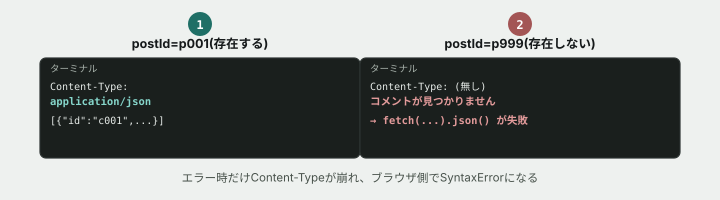

# 08. エラーのときだけ、JSONが読めなくなる



## 目的

本文で「レスポンスの中身をJSONだと思って読もうとしたら、実は`Content-Type: text/html`でエラーページが返ってきていた」という不具合に触れました。今日は、**それに近い不具合を自分のブラウザで再現し、`Content-Type`を手がかりに原因を突き止めます。**

## 状況(ここから、あなたは保守担当です)

> 投稿にコメント機能を追加してほしいという依頼で、前任者が `/api/comments` というAPIを作ってくれました。**投稿にコメントが付いているときは問題なく動くそうです。** コメントが1件も無い投稿や、存在しない投稿を指定したときの動作も、念のため確認してください。

## 準備

```
cd curriculum/05-http-basics/samples
node server.js
```

`つながるノート API サーバー: http://localhost:3300` と表示されたら起動成功です。別のターミナル(タブ)を開いて、以降のコマンドはそちらで打ちます。

## 手順

### 正常系を確認する

- [ ] `curl -sD - http://localhost:3300/api/comments?postId=p001` を実行する **前に**、`Content-Type` が何になると思うか予測してコメントする
- [ ] 実行して結果を貼る。**`Content-Type` は何ですか。本文(ボディ)はJSONとして読める形になっていますか**
- [ ] `curl -sD - http://localhost:3300/api/comments?postId=p002` も実行する(`p002` はコメントが1件も無い投稿です)。**こちらは正常に動きますか。壊れているのはどちらのパターンですか**

### 存在しない投稿を指定する

- [ ] `curl -sD - http://localhost:3300/api/comments?postId=p999`(存在しない `postId`)を実行する **前に**、ステータスコードと `Content-Type` を予測してコメントする
- [ ] 実行して結果を貼る。**さっきと比べて、`Content-Type` の行に違いはありますか。本文はJSONとして読める形になっていますか**

### ブラウザ側の症状を再現する

- [ ] ブラウザの開発者ツールで **Console** タブを開く
- [ ] 次のコードをConsoleに貼り付けて実行する(コメント欄で「AIに考えさせるのは禁止」なのは予測と回答であって、こうした確認用コードの実行は対象外です)

```js
fetch("http://localhost:3300/api/comments?postId=p999")
  .then((res) => res.json())
  .then((data) => console.log("成功:", data))
  .catch((err) => console.error("失敗:", err));
```

- [ ] 実行結果を貼る。**「失敗」の行には、どんなエラーが出ましたか**

## 予測のヒント

`fetch(...).json()` は、**返ってきた本文を、問答無用でJSONとして解析しようとします。** 本文が `{"id":"c001", ...}` のような形になっていなければ、`Content-Type` が何であっても解析に失敗し、`SyntaxError` が発生します。**本文で扱った「Content-Typeが実務で一番効く」という話は、まさにこの場面のことです。** 症状(エラーで落ちる)だけを見ても原因は分かりませんが、`Content-Type` と実際の本文を見比べれば、「JSONのつもりで返していないルートがある」と気づけます。

## 直す

- [ ] `curriculum/05-http-basics/samples/server.js` を開き、`/api/comments` のルートを探す。**該当する投稿が見つからなかったときの処理は、他の正常系と何が違いますか**
- [ ] 見つからなかったときも、他のAPI(`/api/posts/:id` など)と同じように、**`Content-Type: application/json` を付けて、JSON形式のエラーメッセージ**(例: `{"error": "コメントが見つかりません"}`)を返すように直す
- [ ] 保存し、サーバーを再起動する
- [ ] `curl -sD - http://localhost:3300/api/comments?postId=p999` を再実行し、`Content-Type` と本文を確認する
- [ ] ブラウザのConsoleで、さきほどと同じ `fetch` のコードをもう一度実行する。**今度は「失敗」と「成功」、どちらが表示されましたか**

## 考えてみてほしいこと

以下は Issue のコメントに書いてください。

1. 直す前、正常系(`postId=p001`)とエラー系(`postId=p999`)で、`Content-Type` にどんな違いがありましたか。**なぜその違いに気づけば原因を特定できるのですか**
2. 「本文はエラーメッセージとして分かりやすい日本語で書かれているから、これでも十分では」という意見に、あなたはどう反論しますか(ヒント: 読むのは人間だけではありません)
3. あなたが今後APIを作るとしたら、**正常系とエラー系で `Content-Type` を揃えることを、どうやって忘れないようにしますか**

## 完了条件

- 存在しない `postId` を指定したときも、`Content-Type: application/json` でJSON形式のエラーが返ってくること
- ブラウザの `fetch(...).json()` がエラーにならず、`catch` ではなく成功側の処理まで進むこと
- なぜ最初のコードで`SyntaxError`が起きたのかを、`Content-Type`の言葉で説明できていること

## サーバーを止める

`server.js` を実行しているターミナルに戻り、`Ctrl + C` で止めてください。
