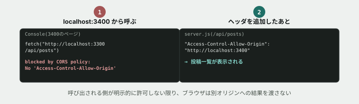

# 10. 別のサイトから呼んだら、ブロックされた



## 目的

`curl` はどんなURLにも自由にリクエストを送れました。しかし**ブラウザは、安全のためにそれを制限しています。** 今日は、その制限(<mark>CORS</mark>)に実際にぶつかり、意図的に許可する方法を学びます。

## 状況(ここから、あなたは保守担当です)

> 別の会社が「お知らせ集約サイト」を作っていて、そこに**つながるノートの投稿を埋め込んで表示したい**という相談が来ました。相手のエンジニアは既に組み込み用のページを作ったそうですが、「投稿が表示されず、コンソールに赤いエラーが出る」と困っています。原因を調べて、こちら側で対応してください。

## 準備

**2つのサーバーを、別々のターミナル(タブ)で同時に起動します。**

つながるノートのAPIサーバー(1つ目のターミナル):

```
cd curriculum/05-http-basics/samples
node server.js
```

お知らせ集約サイトのサーバー(2つ目のターミナル、**別の会社が運営している想定**):

```
cd curriculum/05-http-basics/samples
node partner-site-server.js
```

`お知らせ集約サイト: http://localhost:3400` と表示されたら起動成功です。

## 手順

### 症状を再現する

- [ ] ブラウザで `http://localhost:3400/` を開く。「お知らせ集約サイト」というページが表示されます
- [ ] 開発者ツールを開き、**Console** タブを選ぶ
- [ ] 「つながるノートの投稿を読み込む」ボタンをクリックする **前に**、何が起きると思うか予測してコメントする(ヒント: このページは `http://localhost:3300` という**別のポート番号**のAPIを呼び出そうとしています)
- [ ] クリックする。**画面に何と表示されましたか。Consoleに赤いエラーは出ましたか。その内容を貼る**

### オリジンという考え方

- [ ] 今開いているページのURLは `http://localhost:3400` で、呼び出そうとしたAPIは `http://localhost:3300` でした。**ポート番号だけが違います。** この2つは、ブラウザから見て「同じ場所」だと思いますか、「別の場所」だと思いますか
- [ ] `http://` `ホスト名` `ポート番号` の組み合わせを<mark>オリジン</mark>と呼びます。**この3つのうち、1つでも違えば別オリジンです。**

### Networkパネルでも確認する

- [ ] **Network** タブに切り替え、もう一度「読み込む」ボタンをクリックする
- [ ] 該当するリクエストの行を探す。**ステータスは表示されていますか、それとも赤字で失敗と表示されていますか**

## 予測のヒント

**ブラウザは、あるオリジンのページが、別のオリジンに勝手にリクエストを送って結果を読み取ることを、デフォルトで禁止しています。** これは意地悪ではなく、悪意あるサイトがあなたのログイン情報を使って別のサイトのAPIを勝手に呼び出す、といった攻撃を防ぐための仕組みです。この仕組みを<mark>CORS(Cross-Origin Resource Sharing、オリジンをまたいだ共有)</mark>と呼びます。

**呼び出される側(つながるノートのAPI)が、「このオリジンからは呼んでよい」と明示的に許可しない限り、ブラウザはレスポンスを呼び出し元に渡しません。** `curl` にはこの制限がありません。だからこそ、演習04〜09では `curl` で見えていた通信が、今回はブラウザで再現すると失敗するのです。

## 直す

- [ ] `curriculum/05-http-basics/samples/server.js` を開き、`/api/posts` のルートを探す
- [ ] レスポンスヘッダに、次の1行を追加する

```js
"Access-Control-Allow-Origin": "http://localhost:3400",
```

- [ ] 保存し、`server.js` を再起動する(`partner-site-server.js` は再起動不要です)
- [ ] `http://localhost:3400/` のページをリロードし、もう一度「読み込む」ボタンをクリックする。**投稿は表示されましたか。Consoleにエラーは出ましたか**

## 考えてみてほしいこと

以下は Issue のコメントに書いてください。

1. `Access-Control-Allow-Origin` に、`http://localhost:3400` という**特定のオリジン**ではなく `*`(すべてのオリジンを許可)を指定することもできます。`/api/posts` のような公開情報でも、**どちらを選ぶべきだと思いますか**。理由も書いてください
2. もし `/api/me`(個人情報を返すAPI、演習09で扱いました)に `Access-Control-Allow-Origin: *` を付けてしまったら、何が起きると思いますか
3. `curl` ではCORSに一切引っかかりませんでした。**CORSは「サーバーを守る仕組み」ですか、「ブラウザを使う利用者を守る仕組み」ですか**。自分の言葉で説明してください

## 完了条件

- CORSエラーが再現できていること(エラーメッセージが貼られていること)
- `Access-Control-Allow-Origin` を追加した後、`http://localhost:3400` から投稿が正常に表示されること
- なぜ `curl` では起きなかった不具合が、ブラウザでは起きたのかを説明できていること

## サーバーを止める

`server.js` と `partner-site-server.js`、両方のターミナルで `Ctrl + C` を押して止めてください。
