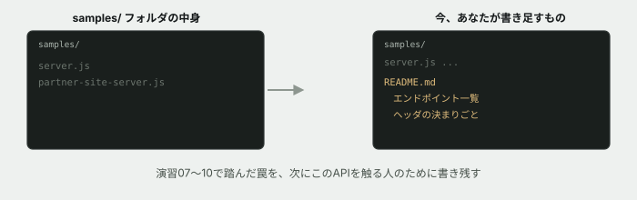

# 11. このAPIサーバーの説明書を、初めて書く

## 目的

演習04〜10で、あなたは `server.js` に何度も手を入れました。しかし**このAPIサーバーには、まだ説明書が1つもありません。** 次にこれを触る人(あなた自身が半年後に見返す場合も含めて)のために、初めて書きます。

## 状況(ここから、あなたは保守担当です)

> お知らせ集約サイトとの連携、無事に直していただきありがとうございました。**このAPIサーバー、他にもエンドポイントが増えていくと思うので、簡単な説明書を残しておいてもらえますか。**

## 準備

`curriculum/05-http-basics/samples/` フォルダを見てください。`server.js` と `partner-site-server.js` はありますが、**説明書(README)はまだありません。**

## 手順

### 振り返る

- [ ] 演習04〜10のIssueを、上から順に読み返してください。**このサーバーには、どんなエンドポイント(URLとメソッドの組み合わせ)がありますか。** 一覧にしてみてください
- [ ] 特に、**あなたが今日までに踏んだ「見えない罠」**を数え上げてください(例: GETで状態が変わってしまう、エラー時だけContent-Typeが違う、個人情報にCache-Controlが無い、別オリジンから呼ぶとCORSでブロックされる)

### README.md を書く

`curriculum/05-http-basics/samples/README.md` を新しく作り、次の内容を書いてください。

- [ ] **このサーバーが何か**(1〜2行でよい)
- [ ] **エンドポイントの一覧と役割** — メソッド・パス・何をするか・認証が必要か、を表のような形で
- [ ] **返ってくるステータスコードの意味** — 200・401・403・404・301・302など、このサーバーが実際に返すもの
- [ ] **ヘッダまわりの決まりごと** — この演習を通して学んだことを、次の人への注意として書く。例:
  - 状態を変える操作にはGETを使わない
  - エラー時も正常時と同じ`Content-Type`で統一する
  - 個人情報を返すAPIには`Cache-Control: no-store`を付ける
  - 別オリジンから呼ばせる場合は`Access-Control-Allow-Origin`を明示する
- [ ] **まだ残っている課題**があれば書く(なければ「特になし」で構いません。ただし、本当に無いか考えてから書いてください)

### 読み手を想像する

- [ ] 書き終えたら、**演習07を始める直前の自分**のつもりで読み返してください。**知りたかったことが書いてありますか**

## 予測のヒント

HTML/CSS基礎の演習12で「保守担当」を経験した人は覚えているかもしれませんが、**説明書は「使い方」だけでなく「踏んではいけない罠」を書いておくことに価値があります。** あなたが今日までに時間をかけて発見したことを、次の人は一瞬で知ることができます。

ヘッダまわりの決まりごとを書くときは、**「なぜそうするのか」も1行添えてください。** ルールだけを並べると、状況が変わったときに応用が利きません。

## 考えてみてほしいこと

以下は Issue のコメントに書いてください。

1. 演習07〜10を通して、**最も時間がかかった(あるいは最も驚いた)不具合はどれでしたか。** なぜそう思いますか
2. 「ヘッダまわりの決まりごと」として書いた項目のうち、**もしこの説明書が最初からあったら、避けられていた不具合はどれですか**
3. あなたが今日書いたREADMEは、**HTTPを学んだことがない人が読んでも分かる内容ですか、それともある程度知っている前提ですか。** どちらを想定して書きましたか

## 完了条件

`samples/README.md` が新しく作られ、エンドポイントの一覧・ステータスコードの意味・ヘッダの決まりごとが書かれていること。演習07を始める前の自分が読んでも迷わない内容になっていること。
