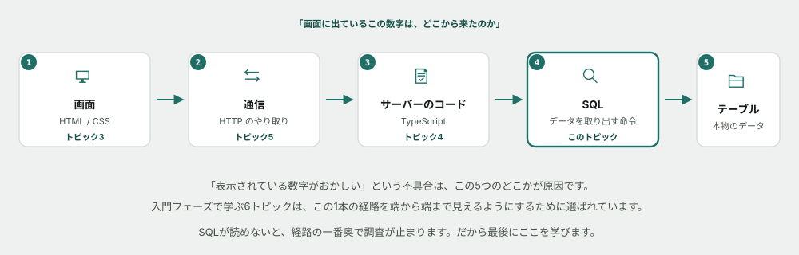
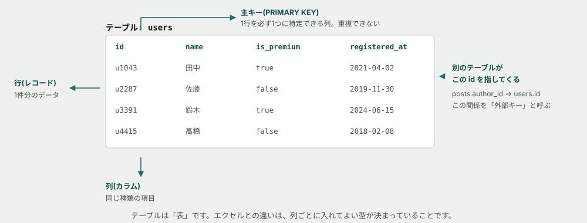
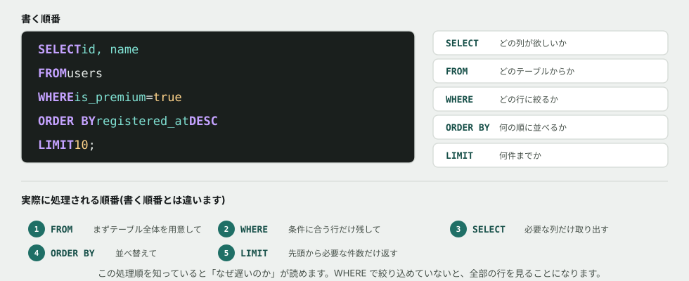
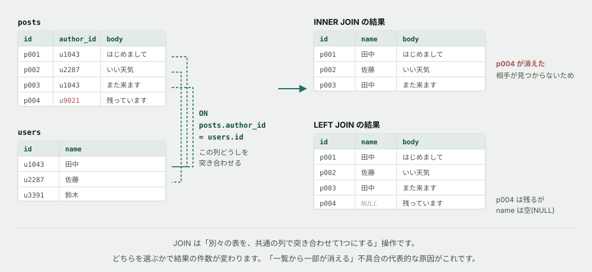
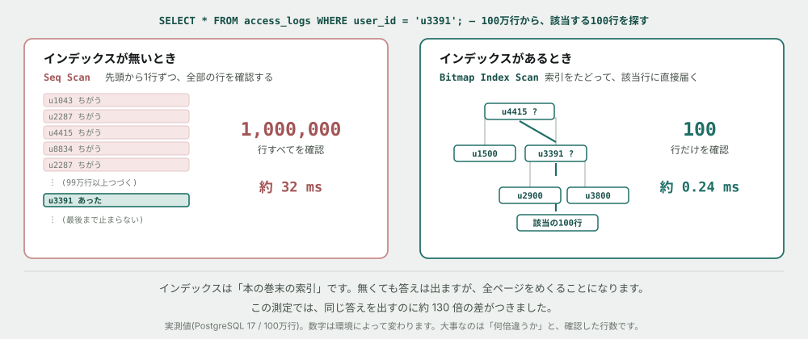
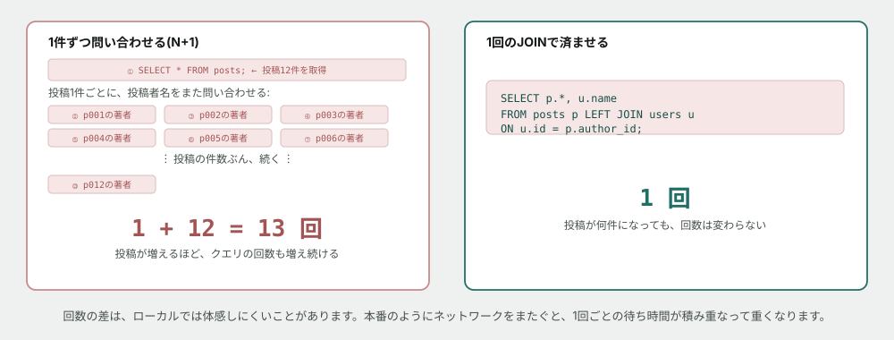
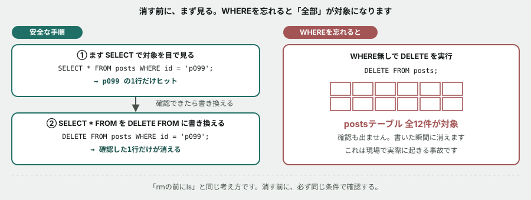
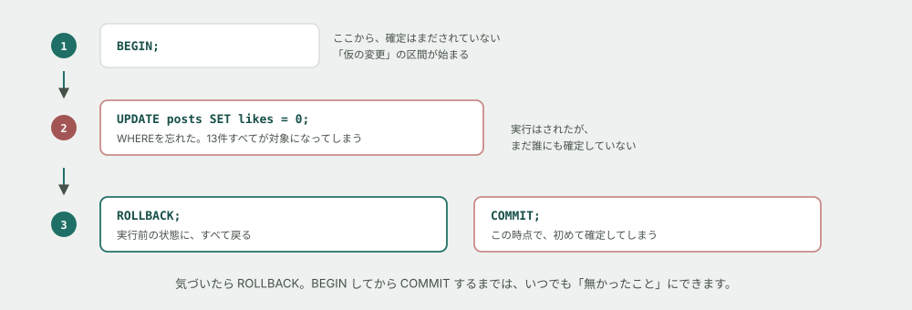

# SQL基礎

## なぜこれを最後に学ぶか

入門フェーズの6トピック目、最後のトピックです。

保守改修の現場でいちばん多い問い合わせは、**「画面に出ているこの数字がおかしい」**です。この調査は、必ず同じ経路をたどります。



*図: 入門フェーズの6トピックは、**この1本の経路を端から端まで見えるようにする**ために選ばれています。*

**SQLが読めないと、経路のいちばん奥で調査が止まります。** 「コードは正しそうだ。でもデータが変だ」というところまで来て、その先に進めなくなる。だから最後にここを学びます。

> [!TIP]
> 読んでいて分からない言葉が出てきたら、AIに聞いて構いません。禁止しているのは、後半の演習(Issue)で自分の予測や回答をAIに考えさせることだけです。詳しくは末尾の「この教材の進め方」を参照してください。
>
> 構文を忘れたときは [早見表(チートシート)](cheatsheet.md) も使ってください。

## テーブルとは — 型のついた表

<mark>データベース</mark>は、データをしまっておく専用のソフトウェアです。中身は<mark>テーブル</mark>という「表」の集まりで、見た目はエクセルによく似ています。



*図: 横が<mark>行</mark>(1件分のデータ)、縦が<mark>列</mark>(同じ種類の項目)。*

**エクセルとの決定的な違いは、列ごとに入れてよい型が決まっていること**です。数値の列に文字列は入りません。これは、プログラミング基礎で学んだ型とまったく同じ考え方です。

| 用語 | 意味 |
|---|---|
| <mark>行(レコード)</mark> | 1件分のデータ。「田中さんのユーザー情報」 |
| <mark>列(カラム)</mark> | 項目。「名前」「登録日」 |
| <mark>主キー</mark> | その行を必ず1つに特定できる列。**重複できない** |
| <mark>外部キー</mark> | 別のテーブルの主キーを指す列。「この投稿を書いたのは誰か」 |

> [!NOTE]
> **コラム: なぜエクセルではダメなのか** — 何百人が同時に書き換えても壊れないこと、100万行から一瞬で1件を探せること、「途中で失敗したら全部なかったことにする」ができること。この3つがエクセルにはありません。**あなたが現場で触るデータは、必ずデータベースの中にあります。**

## SELECT — 取り出す

SQLでいちばん使うのが `SELECT` です。**5つの部品を、決まった順番で並べるだけ**です。



*図: 書く順番と、**実際に処理される順番は違います。** ここが後で効いてきます。*

```sql
SELECT   id, name           -- どの列が欲しいか
FROM     users              -- どのテーブルからか
WHERE    is_premium = true  -- どの行に絞るか
ORDER BY registered_at DESC -- 何の順に並べるか
LIMIT    10;                -- 何件までか
```

**処理される順番を覚えておいてください。** `FROM` でテーブル全体を用意 → `WHERE` で行を絞る → `SELECT` で列を取り出す → `ORDER BY` で並べる → `LIMIT` で切る。

**この順番を知っていると「なぜ遅いのか」が読めます。** `WHERE` で絞れていないクエリは、全部の行を見ることになるからです。

> [!WARNING]
> **`SELECT *` は、学習中は便利ですが実務では避けます。** 使わない列まで全部読み込むため無駄が大きく、さらに**後から列が追加されたときに、意図せず挙動が変わります。** 演習では見やすさのために使いますが、本編では列を明示する癖をつけてください。

## NULLと空文字は別物

`WHERE` で行を絞るとき、**「値が無い」の表し方が2通りある**ことに気づかず事故るのが定番のパターンです。


*図: **空文字(`''`)は「長さ0の文字列」という値がちゃんと入っている状態です。** 一方 <mark>NULL</mark> は「値がある/ないの判定すらできない」という特別な状態で、文字列でも数値でもありません。だから `column = ''` では見つからず、`column IS NULL` と書かないと見つかりません(`=` で `NULL` と比較すること自体ができません)。*

演習01で、実際に`users`テーブルに対してこの2つを試します。**空文字で探すと0件なのに、`IS NULL`で探すと全員が該当する**、という結果の差を自分の目で確認してください。

## JOIN — 表と表をつなぐ

ここがSQLの山場です。

現実のデータは、**1つの表には収まっていません。** 投稿のテーブルには「誰が書いたか」がIDでしか入っておらず、名前は別のテーブルにあります。**なぜそうするのか** — 名前が変わったとき、1箇所を直せば済むからです。投稿の全行に名前を書いていたら、全部を書き換えることになります。

そして表示するときには、両方が必要になります。この突き合わせが <mark>JOIN</mark> です。



*図: 相手が見つからない行の扱いが、**2種類のJOINの唯一にして最大の違い**です。*

```sql
SELECT posts.id, users.name, posts.body
FROM   posts
JOIN   users ON posts.author_id = users.id;
```

| 書き方 | 相手が見つからない行は |
|---|---|
| `JOIN`(= `INNER JOIN`) | **結果から消える** |
| `LEFT JOIN` | **残る。** 相手側の列は `NULL`(空)になる |

> [!IMPORTANT]
> **「一覧から一部のデータが消える」という不具合の、最も代表的な原因がこれです。**
>
> 退会したユーザー、削除された商品、廃止された部署。**参照先が無くなった行は、`INNER JOIN` では黙って消えます。** エラーも警告も出ません。だから気づきにくく、そして「昨日まで12件あったのに今日は10件」という形で発覚します。
>
> **これはプログラミング基礎の演習03と同じ問題です。** あちらは `undefined` になって落ちましたが、SQLでは**落ちずに、静かに消えます。** どちらが厄介かは、考えてみてください。

## 集計する

「何件あるか」「合計はいくらか」を出すのも、SQLの仕事です。

```sql
-- 全部で何件か
SELECT COUNT(*) FROM posts;

-- ユーザーごとに、投稿が何件あるか
SELECT   author_id, COUNT(*) AS post_count
FROM     posts
GROUP BY author_id
ORDER BY post_count DESC;
```

<mark>GROUP BY</mark> は「同じ値のものをまとめて、グループごとに数える」操作です。**プログラミング基礎で書いた `for` ループを、SQL側でやってもらっているのと同じ**です。

| 関数 | やること |
|---|---|
| `COUNT(*)` | 件数 |
| `SUM(列)` | 合計 |
| `AVG(列)` | 平均 |
| `MAX(列)` / `MIN(列)` | 最大 / 最小 |

**まとめた後で、さらに絞り込みたいときは `HAVING` を使います。**

```sql
-- 投稿が3件以上あるユーザーだけ
SELECT   author_id, COUNT(*) AS post_count
FROM     posts
GROUP BY author_id
HAVING   COUNT(*) >= 3;
```

**`WHERE` と `HAVING` は、絞るタイミングが違います。** `WHERE` は集計する**前**に行を絞り、`HAVING` は集計した**後**にグループを絞ります。「投稿が3件以上」は1行ずつ見ても分からず、まとめてから初めて分かる条件なので、`WHERE` には書けません。


*図: 件数は説明用の仮の値です(演習04では実際のデータで確認します)。行がグループにまとまり、まとまった後の件数でさらに絞り込まれる、という2段階になっていることに注目してください。*

## インデックス — なぜ「なぜか重い」が起きるのか

**この節が、このトピックで最も実務に効きます。**

100万行のテーブルから1件を探すとき、データベースは2通りの探し方をします。



*図: **同じSQL文、同じ答え。違うのは所要時間だけ**です。この測定では約130倍。*

<mark>インデックス</mark>は、**本の巻末の索引**とまったく同じものです。無くても答えは出ます。ただし全ページをめくることになります。

**そして重要なのは、インデックスが無くても動いてしまうことです。** 開発中はデータが100行しかないので一瞬で終わり、誰も気づきません。**本番でデータが100万行になったときに、初めて「なぜか重い」として現れます。**

自分で確かめる方法があります。SQL文の前に `EXPLAIN` をつけるだけです。

```sql
EXPLAIN ANALYZE
SELECT * FROM access_logs WHERE user_id = 'u3391';
```

| 出てきた文字 | 意味 |
|---|---|
| **`Seq Scan`** | 全件走査。**全部の行を見ている**(インデックスが使われていない) |
| **`Parallel Seq Scan`** | 同じく全件走査。複数の作業を並行させているだけで、全部見ていることは変わらない |
| **`Index Scan`** | 索引を使った |
| **`Bitmap Index Scan`** | 索引を使った(該当行が多いときに選ばれる形) |
| **`Index Only Scan`** | 索引だけで答えが出た。表を読みにすら行っていない |

> [!TIP]
> **名前が5種類ありますが、見分け方は簡単です。`Index` の文字が入っていれば索引が使われています。** どの形が選ばれるかはデータベースが勝手に決めるので、最初は気にしなくて構いません。`Seq` なのか `Index` なのか、だけを見てください。

**推測せず、`EXPLAIN` を打つ。** これは HTML/CSS基礎で「開発者ツールを開く」と言ったのと、まったく同じ態度です。

> [!IMPORTANT]
> **`Seq Scan` が常に悪いわけではありません。** データベースは毎回「どちらが速いか」を自分で見積もって選びます。**絞り込みが効かない条件では、索引をたどるより全部読んだほうが速い**と判断することがあり、それは正しい判断です。
>
> 演習03で、**インデックスを張ったのに使われない**場面に出会います。そのとき「壊れている」と思わないでください。

> [!NOTE]
> **コラム: では全部の列にインデックスを張ればいいのか** — いいえ。インデックスは**書き込みを遅くします。** 行を1つ足すたびに、索引も更新しなければならないからです。索引が10個あれば、更新も10回。読み取りと書き込みのどちらを優先するかは**設計判断**であり、本編で扱います。

## N+1問題 — 「まとめて取る」を忘れると起きること

インデックスは「1回のクエリを速くする」話でした。ここからは、**クエリの回数そのもの**が問題になる場合です。

「投稿の一覧を、投稿者の名前つきで表示したい」という要件を考えます。JOINを知らない(あるいは使わない)まま実装すると、こう書きたくなります。

1. まず投稿を全部取得する(1回)
2. 投稿1件ごとに、投稿者の名前を問い合わせる(投稿の件数ぶん)



*図: 投稿が **1件増えるたびに、クエリも1回増えます。** これが「N+1」という名前の由来です(最初の1回 + 件数ぶんのN回)。*

**JOINを使えば、これが1回で済みます。** JOIN基礎の節でやったことは、実は最初からこの問題を回避する書き方でした。

> [!IMPORTANT]
> **ローカルの環境では、この差を時間で体感しにくいことがあります。** 手元のパソコンでは、1回の問い合わせがネットワークをまたがずコンマ数ミリ秒で終わるためです。**本番環境では、データベースへの1回ごとの問い合わせにも、往復の通信時間がかかります。** 回数が増えるほど、この待ち時間が積み重なって重くなります。**「今は速いから問題ない」がいちばん危険な油断です。**

> [!NOTE]
> **コラム: ORMを使うと、なぜN+1が起きやすいのか** — 本編で使うDrizzleのようなORMは、「投稿1件を取ってきて、その投稿者を取ってきて」という**オブジェクト指向的な書き方**を許します。書き手がJOINを意識しないまま「関連データも取得する」コードを書くと、知らないうちにN+1になっていることがあります。だからこそ [プログラミング基礎](../04-programming-basics/README.md) のチートシートで「発行されたSQLをログで確認する」と決めています。**疑わしいときは、実際に発行されたSQLの回数を数えてください。**

## 変える・消す(取り扱い注意)

読み取り以外の命令もあります。演習05で実際に使います。

```sql
INSERT INTO posts (id, author_id, body, likes, posted_at) VALUES ('p099', 'u1043', '新しい投稿', 0, now());
UPDATE posts SET likes = 100 WHERE id = 'p099';
DELETE FROM posts WHERE id = 'p099';
```

> [!CAUTION]
> **`UPDATE` と `DELETE` で `WHERE` を書き忘れると、テーブルの全行が対象になります。**
>
> `DELETE FROM users;` は、全ユーザーを消します。確認も出ません。**これは現場で実際に起きる事故で、しかも新人がやりがちです。**
>
> 身を守る手順があります。**まず同じ `WHERE` で `SELECT` を打ち、対象の行を目で見てから、`SELECT` の部分だけ `DELETE` に書き換える。** コマンドライン基礎で「`rm` の前に `ls`」と言ったのと、まったく同じ考え方です。



*図: 同じ「消す」でも、**確認してから書き換えるか、いきなり書くか**で結果がまったく違います。*

## トランザクション — 「確定する前」に戻せる仕組み

**上の事故を、もう1段安全に防ぐ仕組みがあります。** `BEGIN` から `COMMIT` までの間は、変更が**まだ誰にも見えていない「仮の状態」**です。気づいた時点で `ROLLBACK` すれば、何も無かったことにできます。



*図: **`ROLLBACK` は、`BEGIN` した時点まで、すべてをまるごと巻き戻します。***

```sql
BEGIN;

UPDATE posts SET likes = 0;   -- WHEREを忘れた!(事故)

-- ここで気づいたら…
ROLLBACK;   -- 何も無かったことになる

-- 正しく書けていたら…
COMMIT;     -- ここで初めて確定する
```

**`BEGIN` していない通常の1文は、実行した瞬間にそのまま確定します。** `ROLLBACK` で戻せるのは、`BEGIN` してから `COMMIT`(または `ROLLBACK`)するまでの間だけです。**「危険な変更をする前に、まず `BEGIN` を打つ」**を習慣にすると、事故の多くは防げます。

> [!NOTE]
> **コラム: なぜ毎回 `BEGIN` しないのか** — 実務のアプリケーションのコードは、実は多くの操作を自動的にトランザクションの中で行っています。**ここで練習しているのは、`psql` から直接SQLを打つときに、自分の手で安全を確保する方法**です。本編でDrizzleのようなORMを使うと、この仕組みをコードの中から呼び出す形になります。

---

**ここまでが「概念」の話です。** ここから、実際にデータベースに接続します。

## 演習を始める前に — データベースを起動する

演習では、Docker で PostgreSQL を起動します。

| OS | 入れ方 |
|---|---|
| Windows / macOS | [Docker Desktop](https://www.docker.com/products/docker-desktop/) をダウンロードしてインストールし、起動しておく |
| Linux | [Docker Engine](https://docs.docker.com/engine/install/) をディストリの手順に沿って入れる |

インストールできたか確認してください。

```
docker --version
```

バージョン番号が出れば準備完了です。続けてデータベースを起動します。

```
cd curriculum/06-sql-basics/samples
docker compose up -d
```

**`-d` は「バックグラウンドで起動する」というオプションです。** これが無いと、ターミナルがデータベースの出力で占領されたままになります。初回は、100万行のログデータを作るため**1〜3分ほどかかります。** 起動したら接続します。

```
docker compose exec db psql -U app -d tsunagaru
```

<mark>psql</mark>は、PostgreSQLに接続してSQLを打ち込むための対話型ツールです。`-U app` は「`app`というユーザーで」、`-d tsunagaru` は「`tsunagaru`というデータベースに」接続する、という意味です(**この `-d` は先ほどの`docker compose`の`-d`とは無関係の、psql独自のオプションです**)。コマンドごとにオプションの意味が違うのは、コマンドライン基礎で学んだ通りです。

`tsunagaru=#` というプロンプトが出れば成功です。**エラーが出たら、それ自体を Issue にコメントしてください。** 環境構築でつまずくのは普通のことです。

psqlに入ると、SQL文とは別に、`\`(バックスラッシュ)で始まる**psql自身の操作コマンド**が使えます。SQLではないので末尾にセミコロンは要りません。

| 操作 | やること |
|---|---|
| `\dt` | テーブルの一覧を見る |
| `\d users` | `users` テーブルの列と型を見る |
| `\q` | psql を終了する |
| `\x` | 表示を縦向きに切り替える(列が多いとき見やすい) |

**SQL文の最後には、必ずセミコロン `;` が要ります。** 忘れると、いつまでも入力待ちになります(そのときは `;` を打てば進みます)。

## もっと知りたい人へ

**読まなくても演習は完了できます。** 興味が湧いたときにどうぞ。

- [100万行で、インデックスの有無を実測してみる](../columns/index-speed.md) — このトピックの数字を自分の目で見る
- [クラウドとは何か](../columns/what-is-cloud.md) — このデータベースが本番でどこに置かれるのか

AIへの質問例:

- 「トランザクションとは何か、銀行の振込に例えて説明して」
- 「NULL と 空文字 '' の違いを、実務で困る例つきで教えて」

## この教材の進め方

演習は GitHub Issue として1つずつ配られます。**このREADMEを読み終えたら、下の表の順番通りに1→6と進めてください。**

| 順番 | 演習 | 内容 | 目安時間 |
|---|---|---|---|
| 1 | [SELECT と WHERE で取り出す](exercises/01-select-and-where.md) | 表を読む。件数を予測してから実行する | 40〜60分 |
| 2 | [JOIN で、消えるデータを見つける](exercises/02-join-and-missing-rows.md) | INNER と LEFT の差を、自分の目で確認する | 60〜90分 |
| 3 | [なぜか重いクエリの原因を突き止める](exercises/03-explain-and-index.md) | EXPLAIN で全件走査を見つけ、直す | 60〜90分 |
| 4 | [GROUP BYで、データの食い違いに気づく](exercises/04-group-by.md) | HAVINGを使い、いいね数の不一致を発見する | 45〜60分 |
| 5 | [INSERT/UPDATEを、安全に使う](exercises/05-insert-update-safely.md) | トランザクションで、WHERE忘れの事故を安全に体験する | 40〜55分 |
| 6 | [N+1問題を、自分の手で起こす](exercises/06-n-plus-one.md) | 13回の個別クエリと、1回のJOINを比較する | 45〜60分 |

このREADME自体の読了に40〜50分ほど見ているので、**上の6つで合計6〜8時間程度**です。

> [!NOTE]
> **このトピックには合計10時間の枠があり、上の6つでほぼ埋まります。** 残った時間は、講師が別途出す課題(サブクエリ、ウィンドウ関数の初歩など)や、復習に充ててください。

> [!NOTE]
> この時間はまだ実測していない見積もりです。詰まって時間がかかっても、それ自体が確かめたい情報なので気にしないでください。

進め方のルール:

1. **クエリを実行する前に、何件返ってくるかを Issue のコメントに書く**(当たっていなくてよい)
2. 実際に実行し、結果を貼る
3. 予測と結果が違っていたら、なぜ違ったかを一言書く
4. チェックリストをすべて満たしたら Issue を Close する

Closeするかどうかの判断は自分に任されています。承認を待つ必要はありません。ただし**講師は、Closeされた Issue のコメントに後から目を通します。** 一度で完璧である必要はなく、つまずいた形跡も含めて記録として残ることに意味があります。

**なぜ「予測してから実行」なのか**: SQLでは特に効きます。**間違ったクエリでも、たいてい「それらしい結果」が返ってくる**からです。エラーも出ません。件数を先に予測しておけば、「12件のはずが10件しか返らない」というズレに自分で気づけます。**気づけないと、間違った数字がそのまま画面に出ます。**

> [!IMPORTANT]
> **演習の予測・回答をAIに考えさせる／書かせるのは禁止です。** 一方で、**分からない用語や概念をAIに聞いて調べるのは自由**です。「予測してから実行する」の予測は、必ず自分の頭で考えてください。

ここでの目的は構文を「知っている」ことではなく、「この数字がどこから来たかを自分で追える」ことです。分からないときは、AIに聞く前に `SELECT * FROM テーブル名;` で中身を見てください。答えは大抵そこに入っています。
