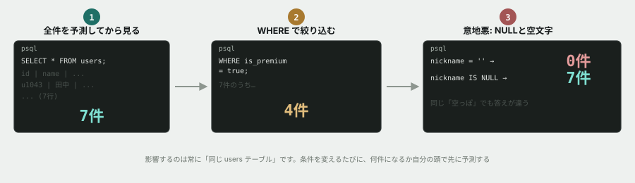
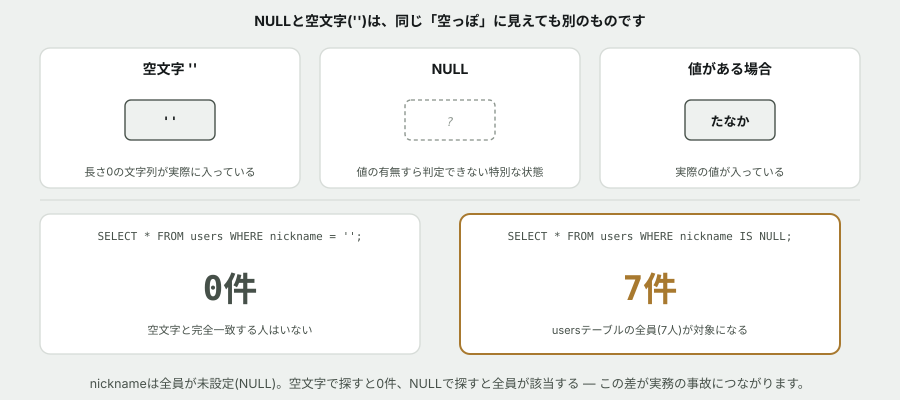

# 01. SELECT と WHERE で取り出す



## 目的

データベースに接続して、実際にデータを取り出す。**件数を予測してから実行する**という癖をここでつける。

SQLは、間違っていても「それらしい結果」を返してきます。エラーが出ないぶん、**自分で気づく仕組みを持っていない人は、間違った数字をそのまま画面に出します。**

## 準備

```
cd curriculum/06-sql-basics/samples
docker compose up -d
```

初回は100万行のログを作るため**1〜3分ほどかかります。** しばらく待ってから接続します。

```
docker compose exec db psql -U app -d tsunagaru
```

`tsunagaru=#` と出れば成功です。エラーが出たら、**そのエラーをこのIssueにコメントしてください。**

## 手順

### まずテーブルを見る

- [ ] `\dt` を実行し、**どんなテーブルがあるか**を貼る
- [ ] `\d users` を実行し、`users` テーブルの**列名と型**を貼る
- [ ] `\d posts` も実行して貼る
- [ ] **`users` の主キーはどの列ですか。** どこを見て判断したかも書く

### 全件を見る

- [ ] `SELECT * FROM users;` を実行する **前に、何件返ってくるか予測して**コメントする
- [ ] 実行して、結果と件数を貼る
- [ ] `SELECT * FROM posts;` も同じように、**予測してから**実行する

### 列を絞る

- [ ] `SELECT id, name FROM users;` を実行し、`SELECT *` との違いを一言で書く
- [ ] **投稿の本文だけを一覧する**クエリを自分で書いて、実行結果を貼る

### 行を絞る(WHERE)

- [ ] `SELECT * FROM users WHERE is_premium = true;` を実行する **前に、何件か予測**する
- [ ] 実行して結果を貼る
- [ ] **2020年より前に登録したユーザー**を出すクエリを自分で書く(ヒント: `registered_at < '2020-01-01'`)
- [ ] **いいねが10件以上ついた投稿**を出すクエリを自分で書く
- [ ] **`u1043` さんの投稿だけ**を出すクエリを自分で書く。**何件か予測してから**実行する

### 並べる・数える

- [ ] `SELECT * FROM posts ORDER BY likes DESC LIMIT 3;` を実行し、結果を貼る
- [ ] **このクエリは何を出していますか。** 日本語1行で説明する
- [ ] `SELECT COUNT(*) FROM posts;` を実行して結果を貼る
- [ ] **プレミアム会員の人数**を数えるクエリを自分で書く

### ここから、少し意地悪です

- [ ] `SELECT * FROM users WHERE nickname = '';` を実行する **前に、何件か予測**してコメントする
- [ ] 実行して結果を貼る。**予測と合っていましたか**
- [ ] `SELECT * FROM users WHERE nickname IS NULL;` も実行して、結果を貼る
- [ ] **この2つの違いを、自分の言葉で説明する**

## 予測のヒント

件数の予測は、**当てることが目的ではありません。** 「だいたい半分くらいのはず」でも構いません。大事なのは、**実行する前に頭の中に期待値を作っておくこと**です。期待値が無いと、返ってきた数字が正しいのかどうか永久に分かりません。

最後の「意地悪」は、`NULL` の扱いを見ています。**`NULL` は「空文字」ではなく「値が存在しない」という状態**です。この違いは、実務で本当に事故ります。



## 考えてみてほしいこと

以下は Issue のコメントに書いてください。

1. `nickname` 列は `\d users` で見ると存在しますが、全員分が空でした。**なぜこんな列があるのだと思いますか**(`seed.sql` にヒントがあります)
2. `SELECT *` は便利ですが、教材本文では「実務では避ける」と書きました。**あなたが実際に使ってみて、避けたほうがいい理由に心当たりはありましたか**
3. 予測が外れたクエリはありましたか。**外れたとき、原因はSQLの書き方でしたか、データについての思い込みでしたか**

## 完了条件

チェックリストがすべて埋まっていること。自分で書いたクエリが4つ以上あること。**`NULL` と空文字の違いが、自分の言葉で説明されていること。**

> [!TIP]
> `docker compose down` で停止できます。**データは残ります。** 次の演習でも同じデータベースを使うので、そのまま起動したままでも構いません。
