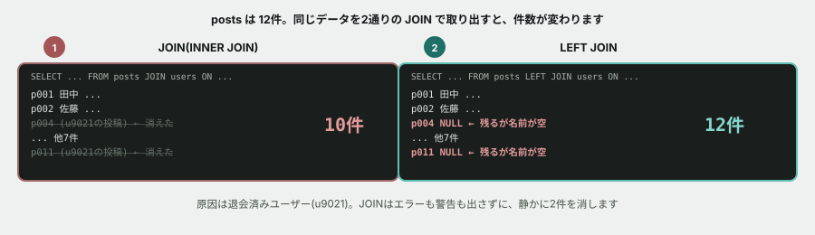

# 02. JOIN で、消えるデータを見つける



## 目的

**現場で最も再現性の高い不具合「一覧から一部のデータが消える」を、自分の手で起こして、自分で見つける。**

この不具合が厄介なのは、**エラーも警告も出ないこと**です。落ちてくれれば気づけます。落ちずに静かに減るから、何ヶ月も誰も気づかないことがあります。

## 状況(ここから、あなたは保守担当です)

> お疲れさまです。つながるノートの管理画面の件です。
>
> 「投稿一覧」に出ている件数と、「投稿の総数」の数字が合っていないという指摘がありました。
> 投稿一覧のほうが少ないようです。原因を調べてください。

## 準備

前の演習のデータベースをそのまま使います。停止していたら起動してください。

```
cd curriculum/06-sql-basics/samples
docker compose up -d
docker compose exec db psql -U app -d tsunagaru
```

## 手順

### 第1段階 — 事実を数える

- [ ] `SELECT COUNT(*) FROM posts;` を実行し、**投稿の総数**を貼る
- [ ] `SELECT COUNT(*) FROM users;` を実行し、**ユーザー数**を貼る

### 第2段階 — 現在の一覧クエリを動かす

管理画面が実際に使っているのが、次のクエリです。

```sql
SELECT   posts.id, users.name, posts.body, posts.likes
FROM     posts
JOIN     users ON posts.author_id = users.id
ORDER BY posts.posted_at;
```

- [ ] **実行する前に、何件返ってくるか予測して**コメントする
- [ ] 実行して、結果と件数を貼る
- [ ] **第1段階で数えた投稿の総数と一致しましたか。** 差は何件でしたか

### 第3段階 — 消えた行を特定する

- [ ] `JOIN` を `LEFT JOIN` に変えただけのクエリを実行し、件数を貼る
- [ ] **今度は総数と一致しましたか**
- [ ] `LEFT JOIN` の結果を見て、**`name` の列が空(NULL)になっている行**を探す。その行の `id` と `body` を貼る
- [ ] **消えていたのは、どの投稿でしたか。** 何件でしたか

### 第4段階 — 原因を突き止める

- [ ] 消えていた投稿の `author_id` を調べる(`SELECT id, author_id FROM posts WHERE ...`)
- [ ] その `author_id` が `users` テーブルに存在するかを確認するクエリを、自分で書いて実行する
- [ ] **なぜ `JOIN` だと消えるのかを、自分の言葉で1〜2行で説明する**
- [ ] `seed.sql` をエディタで開き、**該当箇所のコメントを探して貼る。** 書いた人は何を知っていましたか

### 第5段階 — NULL を安全に扱う

`LEFT JOIN` にすると行は残りますが、名前が `NULL` になります。画面に「NULL」と出るのは困ります。

- [ ] `COALESCE(users.name, '退会したユーザー')` という書き方を調べて(AIに聞いても構いません)、**名前が空のときに「退会したユーザー」と表示されるクエリ**を書く
- [ ] 実行して結果を貼る

### 第6段階 — 別の切り口でも数える

- [ ] **ユーザーごとの投稿数**を出すクエリを書く(`GROUP BY` を使います)
- [ ] その合計は、投稿の総数と一致しますか。**一致しない場合、なぜですか**
- [ ] `LEFT JOIN` と `GROUP BY` を組み合わせて、**「退会したユーザー」もまとめて1行として出る**ようにしてみる

### 第7段階 — 報告する

- [ ] 以下の形式で、依頼者への報告をコメントに書いてください

```
【現象】
【原因】
【対応案】
【判断が必要な点】
```

**「対応案」は複数あるはずです。** どちらが正しいかは、あなたが決めることではなく、依頼者に確認することかもしれません。**そこを分けて書けているかを見ています。**

## 予測のヒント

第2段階の件数予測は、**多くの人が外します。** それでいいです。外れたことに気づけるかどうかがこの演習の主題です。

第4段階の「なぜ消えるのか」は、教材本文のJOINの図をもう一度見てください。**`INNER JOIN` は「両方の表にある行だけ」を残します。**

## 考えてみてほしいこと

以下は Issue のコメントに書いてください。

1. この不具合は、**開発中には絶対に気づけません。** なぜだと思いますか(ヒント: 開発中のデータには、退会したユーザーがいません)
2. **「退会したユーザーの投稿を表示するべきか、しないべきか」** — あなたはどちらが正しいと思いますか。**正解はありません。** ただし、どちらを選ぶにしても「誰に確認すべきか」は決まっているはずです
3. プログラミング基礎の演習03でも、同じ `u9021` が原因でした。あちらは**プログラムが落ちました**が、SQLでは**静かに消えました。** **どちらのほうが厄介**だと思いますか。理由も書いてください
4. そもそも `posts.author_id` に、存在しないIDが入れられてしまうこと自体を防ぐ方法はあると思いますか(調べてもAIに聞いても構いません)

## 完了条件

- 消えていた投稿を特定できていること(id が書かれていること)
- **なぜ消えるのかが、自分の言葉で説明されていること**
- `COALESCE` を使ったクエリが動いていること
- 第7段階の報告が書かれていて、**「対応案」と「判断が必要な点」が分けて書かれていること**
