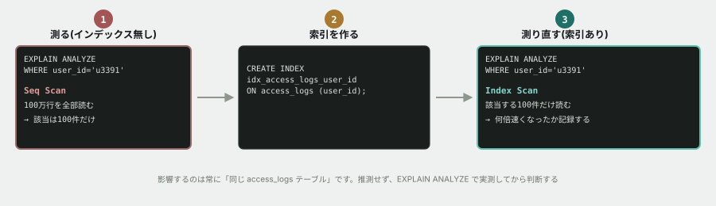

# 03. なぜか重いクエリの原因を突き止める



## 目的

**入門フェーズ最後の演習です。**

「なぜか重い」を、感覚ではなく**数字で**説明できるようになる。そして、その数字を自分で測る道具(`EXPLAIN ANALYZE`)を手に入れる。

これは [到達水準の定義](https://github.com/k-kubo-ez/ai-engineer-education) で「AI時代でも必要性が増したもの」として名指しされている **「インデックスがないと何が起きるか」** そのものです。

## 状況(ここから、あなたは保守担当です)

> お疲れさまです。管理画面の「ユーザー別アクセス履歴」が、開くのに数秒かかるという苦情が来ています。
>
> リリース直後は速かったそうです。**コードは何も変えていません。**
> 原因を調べて、対応してください。

## 準備

前の演習のデータベースをそのまま使います。

```
cd curriculum/06-sql-basics/samples
docker compose up -d
docker compose exec db psql -U app -d tsunagaru
```

## 手順

### 第1段階 — 規模を知る

- [ ] `SELECT COUNT(*) FROM access_logs;` を実行し、**行数**を貼る
- [ ] `\d access_logs` を実行し、列と型、そして **Indexes の欄**を貼る
- [ ] `\d posts` の Indexes 欄とも見比べて、**違いを一言で**書く

### 第2段階 — 遅さを体感する

管理画面が使っているのが、次のクエリです。

```sql
SELECT * FROM access_logs WHERE user_id = 'u3391' ORDER BY accessed_at DESC LIMIT 20;
```

- [ ] `\timing on` を実行する(実行時間が表示されるようになります)
- [ ] 上のクエリを実行し、**かかった時間(Time)を貼る**
- [ ] **同じクエリを3回実行**して、3回分の時間を貼る(1回目だけ遅い場合があります)

### 第3段階 — 測る、推測しない

- [ ] クエリの先頭に `EXPLAIN ANALYZE` をつけて実行する

```sql
EXPLAIN ANALYZE
SELECT * FROM access_logs WHERE user_id = 'u3391' ORDER BY accessed_at DESC LIMIT 20;
```

- [ ] **出力を全部貼る**
- [ ] 出力の中に **`Seq Scan`** という文字がありますか。あればその行を貼る(**`Parallel Seq Scan` と出ることもあります。** 並行して読んでいるだけで、全部見ていることは同じです)
- [ ] **`rows=` という数字**を探して貼る
- [ ] `cost=` の右側の数字も貼る。これは**データベースが見積もった処理量**です
- [ ] **第1段階で数えた総行数と比べて、どうでしたか**

### 第4段階 — 直す

- [ ] **インデックスを作る前に、どれくらい速くなるか予測して**コメントする(「2倍」でも「100倍」でも構いません)
- [ ] インデックスを作る

```sql
CREATE INDEX idx_access_logs_user_id ON access_logs (user_id);
```

- [ ] `\d access_logs` を実行し、**Indexes 欄が増えていること**を確認して貼る
- [ ] 第2段階と同じクエリを実行し、**時間を貼る**
- [ ] **何倍速くなりましたか。** 予測と合っていましたか
- [ ] `EXPLAIN ANALYZE` をもう一度実行し、**`Seq Scan` が何に変わったか**を貼る

> [!TIP]
> `Index Scan` ではなく **`Bitmap Index Scan`** と出たかもしれません。**それで正解です。** 該当する行が複数あるとき、PostgreSQL はこちらの形を選びます。**`Index` の文字が入っていれば、インデックスは使われています。**

### 第5段階 — インデックスを張ったのに、使われない

**ここがこの演習で一番面白いところです。**

`status` 列(HTTPステータスコード)を題材にします。まず、どんな値が何件あるかを見てください。

- [ ] `SELECT status, COUNT(*) FROM access_logs GROUP BY status ORDER BY status;` を実行して、結果を貼る
- [ ] `status` にインデックスを作る

```sql
CREATE INDEX idx_access_logs_status ON access_logs (status);
ANALYZE access_logs;
```

- [ ] **インデックスを張ったので、当然使われるはずです。** 次のクエリを `EXPLAIN ANALYZE` して、結果を貼る

```sql
EXPLAIN ANALYZE SELECT * FROM access_logs WHERE status = 200;
```

- [ ] **`Index` の文字は出ましたか。** 出た/出なかったを書く
- [ ] 次に、**同じ列・同じインデックスのまま**、値だけ変えて実行する

```sql
EXPLAIN ANALYZE SELECT * FROM access_logs WHERE status = 500;
```

- [ ] **今度はどうでしたか。** 結果を貼る
- [ ] **同じインデックスなのに、値によって結果が変わりました。なぜだと思いますか。** 第5段階の最初に数えた件数が答えです

> [!IMPORTANT]
> インデックスが使われなかったのは、**壊れているからでも、あなたの書き方が悪いからでもありません。** データベースが「この条件なら、索引をたどるより全部読んだほうが速い」と**見積もって、そう決めた**のです。そして、その判断はたいてい正しいです。

### 第5段階のおまけ — その判断は本当に正しかったのか

データベースを疑ってみることもできます。**無理やりインデックスを使わせて、測ってみましょう。**

- [ ] **測る前に予測する。** 無理やりインデックスを使わせたら、速くなると思いますか、遅くなると思いますか、変わらないと思いますか
- [ ] `SET enable_seqscan = off;` を実行する(**このセッションだけ、全件走査を禁止する設定です**)
- [ ] `status = 200` のクエリをもう一度 `EXPLAIN ANALYZE` して、貼る
- [ ] **今度は `Index` の文字が出たはずです。** かかった時間を、禁止する前と比べて貼る
- [ ] **予測と合っていましたか**
- [ ] `SET enable_seqscan = on;` で元に戻す

> [!NOTE]
> **劇的な差は出ないかもしれません。** 手元の測定では、禁止する前と後でほとんど変わりませんでした。
>
> **その「ほとんど変わらない」こそが答えです。** 57%の行が該当する条件では、索引をたどっても結局ほとんど全部の行を読むことになるので、**どちらのやり方でもやることは大差ない**のです。だからインデックスを張っても意味がなく、データベースは張っていないほうを選びました。
>
> 一方 `status = 500` は14%です。**そちらでは差がつきました。** 第4段階の `user_id`(全体の0.01%)では、桁が違う差がつきました。**「どれだけ絞り込めるか」だけで、インデックスの価値は決まります。**

### 第6段階 — 報告する

- [ ] 以下の形式で、依頼者への報告をコメントに書いてください

```
【現象】
【原因】
【対応】
【効果(数字で)】
【今後の注意点】
```

**「効果」は必ず数字で書いてください。** 「速くなりました」ではなく「820ms → 0.4ms(約2000倍)」と書けることが、この演習のゴールです。

## 予測のヒント

第2段階で「思ったより遅くない」と感じるかもしれません。**それでも `EXPLAIN ANALYZE` を打ってください。** 100万行で0.5秒なら、1000万行では5秒です。**問題は今の遅さではなく、データが増えたときに何が起きるかです。**

第5段階は少し難しい問題です。**インデックスは「絞り込める」ときにしか役に立ちません。**

第5段階の最初に数えた件数を見返してください。100万行のうち `status = 200` は何件でしたか。**半分以上残るなら、索引をたどっても結局ほとんど全部の行を読むことになります。** それなら最初から全部読んだほうが速い、とデータベースは判断します。

第4段階の `user_id = 'u3391'` は100件でした。**100万分の100 = 0.01%。** ここまで絞り込めるなら、索引の価値が出ます。

## 考えてみてほしいこと

以下は Issue のコメントに書いてください。

1. **「リリース直後は速かった」のに遅くなったのはなぜ**ですか。コードは変わっていません
2. この問題は、**開発中に気づけたと思いますか。** 気づくためには何が必要でしたか
3. 教材本文に「全部の列にインデックスを張ればいいわけではない」と書きました。**第5段階の結果も踏まえて**、なぜダメなのかを説明してください
4. AIに「このクエリが遅いです、どうすればいいですか」と聞けば、たぶん「インデックスを張ってください」と答えます。**その答えが正しいかどうかを、あなたはどうやって確かめますか**
5. **入門フェーズの6トピックを全部終えた今、「画面のこの数字がおかしい」と言われたら、どういう順番で調べますか。** 手順を書いてみてください(SQL基礎のREADMEの最初の図が参考になります)

## 完了条件

- インデックスを作る前と後の**実測値が両方**貼られていること
- `EXPLAIN ANALYZE` の出力で、**`Seq Scan` が別のものに変わったこと**が確認できていること
- 第6段階の報告で、**効果が数字で書かれていること**
- 「考えてみてほしいこと」の5番(調査手順)が書かれていること

> [!NOTE]
> **これで入門フェーズの演習はすべて終わりです。** お疲れさまでした。
>
> 6つのトピックで学んだことは、**どれも特定の言語やツールの知識ではありません。** 「今どこにいるかを確認する」「推測せず、見る」「予測してから実行する」「エラーを読む」「数字で説明する」。**配属先が何の言語であっても、これらは持ち越せます。**
>
> 本編では、これを**他人が書いた、事情のある本物のコードベース**の上でやってもらいます。
