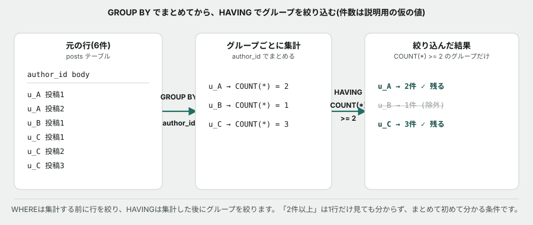

# 04. GROUP BYで、データの食い違いに気づく


## 目的

`GROUP BY` と `HAVING` を組み合わせて集計レポートを作る。そして、**集計した結果が、既存の数字と食い違うことに自分で気づく**演習です。



## 状況

`posts` テーブルには、投稿ごとの「いいね数」が `likes` という列にあらかじめ入っています。一方、**誰が何にいいねしたかを記録する `likes` テーブルも別に存在します。**

> お疲れさまです。管理画面のいいね数の表示が正しいか、念のため確認をお願いします。

## 準備

```
cd curriculum/06-sql-basics/samples
docker compose up -d
docker compose exec db psql -U app -d tsunagaru
```

## 手順

### まず、集計の練習

- [ ] `SELECT author_id, COUNT(*) AS post_count FROM posts GROUP BY author_id ORDER BY post_count DESC;` を実行する **前に**、投稿数が一番多いのは誰か予測してコメントする
- [ ] 実行して結果を貼る
- [ ] **投稿が2件以上あるユーザーだけ**を出すクエリを、`HAVING` を使って自分で書く
- [ ] `likes` テーブルを使って、**ユーザーごとに、何回いいねをしたか**を集計するクエリを書く(ヒント: `GROUP BY user_id`)

### 本題 — 数字を突き合わせる

- [ ] 次のクエリを実行する **前に**、`posts.likes` の値と、`likes` テーブルから数えた実際の件数が**一致すると思うか**予測してコメントする

```sql
SELECT p.id,
       p.likes AS stored_likes,
       COUNT(l.user_id) AS actual_likes
FROM   posts p
LEFT JOIN likes l ON l.post_id = p.id
GROUP BY p.id, p.likes
ORDER BY p.id;
```

- [ ] 実行して結果を全部貼る
- [ ] **予測と合っていましたか。** `stored_likes` と `actual_likes` が一致している行は何件ありましたか
- [ ] **一致していない行について、あなたの考えを書いてください。** 正解はありません。以下のどれに近いか、あるいは他の可能性か、理由もあわせて書く
  - `posts.likes` が正しく、`likes` テーブルへの記録が漏れている
  - `likes` テーブルが正しく、`posts.likes` はどこかの時点で壊れた古い数字
  - 両方とも、それぞれ別の目的で使われている数字で、食い違っていて正常

### 調べ方を考える

- [ ] `likes` テーブルの `liked_at` 列(いつ、いいねされたか)を見てください。`SELECT MIN(liked_at), MAX(liked_at) FROM likes;` を実行し、結果を貼る
- [ ] **この日付の範囲から、何か手がかりは得られますか**(推測で構いません)

## 予測のヒント

**この演習に、決まった正解はありません。** SQL基礎のこれまでの演習では「正しい答え」がありましたが、ここでは**「食い違いに気づけたかどうか」**そのものが到達点です。実務のデータは、こうした食い違いだらけです。

## 考えてみてほしいこと

以下は Issue のコメントに書いてください。

1. もしあなたが「いいね数ランキング」を作るとしたら、`posts.likes` と `likes` テーブルの集計、**どちらを使いますか。** 理由も書く
2. この食い違いに気づかないまま新機能を作ってしまったら、**どんな不具合につながると思いますか**
3. `posts.likes` のような「集計済みの数字をあらかじめ持っておく列」には、どんな利点があると思いますか(ヒント: `COUNT(*)` を毎回計算するのと、あらかじめ持っておくのとで、どちらが速いか)

## 完了条件

`HAVING` を使ったクエリ、`likes` テーブルの集計クエリがそれぞれ動くこと。`stored_likes` と `actual_likes` の突き合わせ結果が貼られ、食い違いについて自分の考えが書かれていること。
