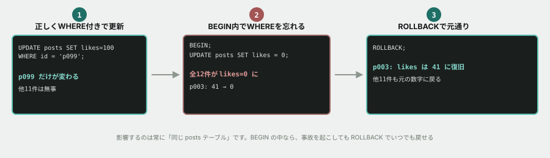

# 05. INSERT/UPDATEを、安全に使う



## 目的

データを作る・変える操作を実際にやる。そして**「WHEREを忘れる」という、現場で本当に起きる事故を、安全な場所で一度体験して**おく。


## 準備

前の演習のデータベースをそのまま使います。

```
cd curriculum/06-sql-basics/samples
docker compose up -d
docker compose exec db psql -U app -d tsunagaru
```

## 手順

### INSERT — 新しいデータを作る

- [ ] 次のクエリで、新しい投稿を1件追加する

```sql
INSERT INTO posts (id, author_id, body, likes, posted_at)
VALUES ('p099', 'u1043', 'これはテスト投稿です。', 0, now());
```

- [ ] `SELECT * FROM posts WHERE id = 'p099';` で、追加されたことを確認する

### UPDATE — 正しくWHEREを付けて直す

- [ ] `UPDATE posts SET likes = 100 WHERE id = 'p099';` を実行する
- [ ] `SELECT id, likes FROM posts WHERE id = 'p099';` で確認する

### 事故を、安全な場所で起こす

**ここからは、`BEGIN` の中で行うので安心して進めてください。**

- [ ] `BEGIN;` を実行する(トランザクションを開始する)
- [ ] 次のクエリを実行する **前に**、何件が対象になるか予測してコメントする

```sql
UPDATE posts SET likes = 0;
```

- [ ] 実行する。`UPDATE ◯` という結果が出るはずです。**◯件でしたか。** 予測と合っていたか書く
- [ ] `SELECT id, likes FROM posts ORDER BY id;` を実行し、**全員のいいね数が0になってしまったこと**を確認する
- [ ] **ここで青ざめてください。** そして `ROLLBACK;` を実行する
- [ ] もう一度 `SELECT id, likes FROM posts ORDER BY id;` を実行し、**元の数字に戻っていることを確認する**

### 正しく直す

- [ ] 本当にやりたかったのは「p099だけ」だったとして、正しい `WHERE` を付けたクエリを自分で書いて実行する

### 後片付け

- [ ] `DELETE FROM posts WHERE id = 'p099';` で、追加したテスト投稿を消す
- [ ] `SELECT COUNT(*) FROM posts;` で、件数が12件に戻っていることを確認する

## 予測のヒント

`BEGIN` を打ってからは、**何をしても実際のデータは壊れません。** `ROLLBACK` すればいつでも元に戻せます。これは、Git基礎の演習04で「コンフリクトを安全な場所で起こした」のと同じ発想です。**壊すことを恐れず、まず試す。**

## 考えてみてほしいこと

以下は Issue のコメントに書いてください。

1. もし `BEGIN` を打たずに `UPDATE posts SET likes = 0;` を実行していたら、何が起きていましたか。**取り消す方法はありましたか**(このトピックでは扱っていない方法も含めて、調べてもAIに聞いても構いません)
2. 本番のデータベースを操作するとき、**あなたは今日から何を習慣にしますか**
3. `BEGIN` を毎回打つのは面倒に感じるかもしれません。**それでも打つべき場面と、打たなくてよい場面**をあなたなりに分けてみてください

## 完了条件

INSERT・UPDATE(正しいWHERE付き)が実行されていること。`BEGIN` → 事故の再現 → `ROLLBACK` → 復旧確認、の一連の流れが記録されていること。最後にp099が正しく削除されていること。
