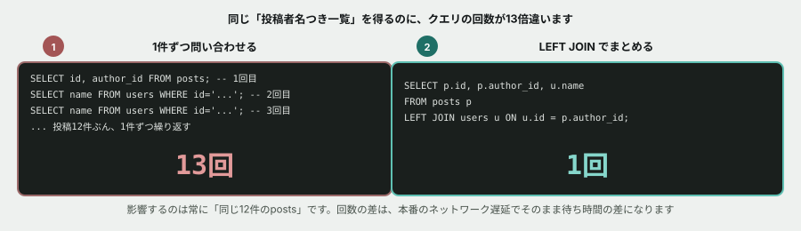

# 06. N+1問題を、自分の手で起こす



## 目的

**入門フェーズ最後の演習です。** クエリの「回数」が問題になる場面を、実際に手で再現し、数える。

## 状況

> お疲れさまです。「投稿一覧を、投稿者の名前つきで表示する」機能について、実装方針を相談させてください。JOINを使わない書き方でも動くには動くのですが、どちらがいいか確認したいです。

## 準備

前の演習のデータベースをそのまま使います。

```
cd curriculum/06-sql-basics/samples
docker compose up -d
docker compose exec db psql -U app -d tsunagaru
```

## 手順

### N+1パターンを、自分の手で再現する

**ここでは、あえて非効率な方法を体験します。**

- [ ] `SELECT id, author_id FROM posts ORDER BY id;` を実行し、12件の投稿IDと投稿者IDの一覧を貼る(**これが1回目のクエリです**)
- [ ] 一覧の**1件目**の `author_id` について、`SELECT name FROM users WHERE id = '<author_id>';` を実行し、名前を確認する(**これが2回目**)
- [ ] 同じことを、**残り11件すべてについて**、1件ずつ実行する(3回目から13回目)
- [ ] **合計で何回クエリを打ちましたか。** 数えてコメントに書く

> [!TIP]
> 12回すべて手で打つのは大変です。面倒に感じたら、**それ自体がこの演習の伝えたいことです。** 「面倒だから、まとめて取得する方法が欲しくなる」という感覚を体験してください。

### 1回のJOINと比べる

- [ ] 次のクエリを実行する

```sql
SELECT p.id, p.author_id, u.name
FROM   posts p
LEFT JOIN users u ON u.id = p.author_id
ORDER BY p.id;
```

- [ ] **同じ結果が、何回のクエリで得られましたか**
- [ ] 先ほどの13回と見比べて、差を1行で書く

### 退会したユーザーの扱いを確認する

- [ ] `p004` と `p011` の投稿者は、演習02で見た**退会済みユーザー**(`u9021`)です。1件ずつ問い合わせる方法(`SELECT name FROM users WHERE id = 'u9021';`)で試すと、**結果はどうなりますか**
- [ ] 同じ投稿者について、`LEFT JOIN` の結果ではどう表示されていますか。**2つの方法で、結果の「形」に違いはありましたか**

## 予測のヒント

**この演習で一番伝えたいのは、時間の差ではなく回数の差です。** あなたのパソコンでは、1回の問い合わせがネットワークをまたがずコンマ数ミリ秒で終わるため、**13回でも1回でも、体感できる時間差はほとんど無いはずです。**

**しかし回数は、確実に13倍です。** 本番環境ではデータベースへの1回ごとの問い合わせに通信の往復時間がかかるため、この回数の差がそのまま待ち時間の差になります。投稿が1万件になれば、10,001回のクエリと1回のクエリの差になります。

## 考えてみてほしいこと

以下は Issue のコメントに書いてください。

1. 13回手で打つのと、1回のJOINを書くのと、**あなたはどちらが「楽」だと感じましたか。** それは、書く手間の話ですか、実行される回数の話ですか
2. 本編でDrizzleというORMを使います。ORMは「投稿を取得する」「その投稿者を取得する」を、それぞれ別々の関数呼び出しとして書けてしまいます。**書いている本人が、JOINしているつもりが無いままN+1を作ってしまう**のは、なぜだと思いますか
3. あなたが本編でコードレビューをするとして、**N+1問題が仕込まれたPRを、どうやって見つけますか**(ヒント: プログラミング基礎で決めた「発行されたSQLをログで確認する」を思い出してください)

## 完了条件

13回の個別クエリと、1回のJOINクエリ、両方を実際に実行し、結果を比較していること。退会済みユーザーの扱いの違いが確認できていること。
